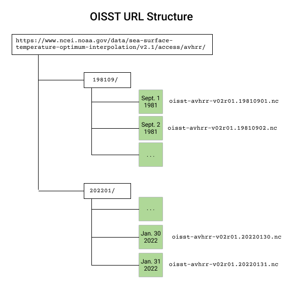
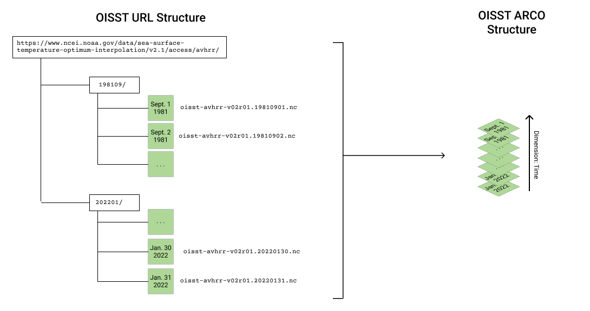
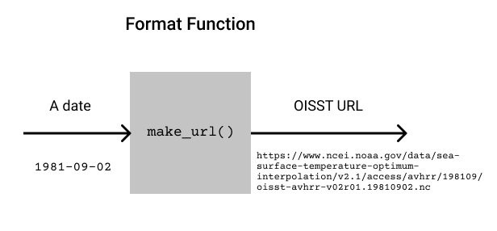

# Defining a `FilePattern`

Welcome to the Pangeo Forge introduction tutorial! This is the 1st part in a sequence, the flow of which is described {doc}`here </introduction_tutorial/index>`.

## Part 1 Outline

The main goal of the first two parts of this tutorial are to create and run a **recipe**, the object that defines our data transformation.

In part 1 we create a `FilePattern` object. A `FilePattern` contains everything Pangeo Forge needs to know about where the input data are coming from and how the individual files should be organized into the output. They are a huge step toward creating a recipe.

The steps to creating a `FilePattern` are:

1. Understand the URL Pattern for OISST & Create a Template String
2. Define the **Combine Dimension** object
3. Create a Format Function
4. Define a `FilePattern`

We will talk about each of these one at a time.

### Where should I write this code?

Eventually, all of the code defining the recipe will go in a file called `recipe.py`, so one option for development is to develop your recipe directly in that file. Alternately, if you prefer the interactivity of a notebook you can work on your recipe code in a Jupyter Notebook and then copy the final code to a single `.py` file later. The choice between the two is personal preference.

## Understand the URL Pattern for OISST & Create a Template String

### Explore the structure

In order to create our Recipe, we have to understand how the data are organized on the server.
Like many datasets, OISST is available over the internet via the HTTP protocol.
We can browse the the files at this URL:

<https://www.ncei.noaa.gov/data/sea-surface-temperature-optimum-interpolation/v2.1/access/avhrr/>

By clicking the link, we can explore the organization of the dataset, which we need to do in order to build our Recipe.

The link above shows folders grouped by month. Within each month there is data for individual days. We could represent the file structure like this:



The important takeaways from this structure exploration are:
- 1 file = 1 day
- Folders separate months

### A single URL

By putting together the full URL for a single file we can see that the OISST dataset for December 9th, 1981 would be accessed using the URL:

[https://www.ncei.noaa.gov/data/sea-surface-temperature-optimum-interpolation/v2.1/access/avhrr/198112/oisst-avhrr-v02r01.19811209.nc](https://www.ncei.noaa.gov/data/sea-surface-temperature-optimum-interpolation/v2.1/access/avhrr/198112/oisst-avhrr-v02r01.19811209.nc)

Copying and pasting that url into a web browser will download that single file to your computer.

If we just have a few files, we can just manually type out the URLs for each of them.
But that isn't practical when we have thousands of files.
We need to understand the _pattern_.
s

### Create a URL Template String

We can generalize the URL to say that OISST datasets are accessed using a URL of the format:

`https://www.ncei.noaa.gov/data/sea-surface-temperature-optimum-interpolation/v2.1/access/avhrr/{time:%Y%m}/oisst-avhrr-v02r01.{time:%Y%m%d}.nc`

where `{time:%Y%m}` (representing a year and a month) and `{time:%Y%m%d}` (representing a year, month, and day) change for each file. (We're using direct string interpolation of `datetime` objects here, anything that [strftime](https://strftime.org/) supports can be put in). Of the three dimensions of this dataset - latitude, longitude and time - the individual files are split up by time.
Our goal is to combine, or _concatenate_, these files along the time dimension into a single Zarr dataset.



### Why does this matter so much?

A Pangeo Forge {class}`FilePattern <pangeo_forge_recipes.patterns.FilePattern>` is built on the premise that

1. We want to combine many individual small files into a larger dataset along one or more dimensions using either "concatenate" or "merge" style operations.
2. The individual files are accessible by URL and organized in a predictable way.
3. There is a some kind of correspondance, or mapping, between the dimensions of the combination process and the actual URLs.

Knowing the generalized structure of the OISST URL leads us to start building the pieces of a `FilePattern`.

## About the `FilePattern` object

```{note}
`FilePattern`s are probably the most abstract part of Pangeo Forge.
It may take some time and experience to become comfortable with the `FilePattern` concept.
```

The goal of the `FilePattern` is to describe how the files in the generalized URL template string should be organized when they get combined together into a single zarr datastore.

In order to define a `FilePattern` we need to:
1. Know the dimension of data that will be used to combine the files. In the case of OISST the dimension is time.
2. Define the values of the dimension that correspond to each file, called the `key`s
3. Create a function that converts the `key`s to the specific URL for each file. We call this the Format Function.

The first two pieces together are called the **Combine Dimension**. Let's start by defining that.

## Define the **Combine Dimension**

The {class}`Combine Dimenion <pangeo_forge_recipes.patterns.ConcatDim>` describes the relationship between files. In this dataset we only have one combine dimension: time. There is one file per day, and we want to concatenate the files in time. We will use the Pangeo Forge object `ConcatDim()`.

We also want to define the values of time that correspond to each file. These are called the `key`s. For OISST this means creating a list of every day covered by the dataset. The easiest way to do this is with the Pandas `date_range` function.

```{literalinclude} ../../docs_src/noaa_oisst.py
---
language: python
lines: 2,6
---
```

These will be the `key`s for our **Combine Dimension**.
We now define a {class}`ConcatDim <pangeo_forge_recipes.patterns.ConcatDim>` object as follows:

```{literalinclude} ../../docs_src/noaa_oisst.py
---
language: python
lines: 3,16
---
```
The `nitems_per_file=1` option is a hint we can give to Pangeo Forge.
It means, "we know there is only one timestep in each file".
Providing this hint is not necessary, but it makes some things more efficient down the line.

## Define a Format Function

Next we we need to write a function that takes a single key (here representing one day) and translates it into a URL to a data file.
This is just a standard Python function.

```{caution}
If you're not comfortable with writing Python functions, this may be a good time to review
the [official Python tutorial](https://docs.python.org/3/tutorial/controlflow.html#defining-functions)
on this topic.
```

So we need to write a function that takes a date as its argument and returns the correct URL for the OISST file with that date.



Because python's string interpolation directly supports formatting datetime objects, all we need
to do is call `.format(time=...)` with a datetime object (the supported arguments as the same as
the python [strftime](https://strftime.org/) function).

We can now write our function calling `.format(...)` on the URL_FORMAT string we created earlier

```{literalinclude} ../../docs_src/noaa_oisst.py
---
language: python
lines: 8-14
---
```

> TODO: Try it out!

> make_url(dates[0])
> 'https://www.ncei.noaa.gov/data/sea-surface-temperature-optimum-interpolation/v2.1/access/avhrr/198109/oisst-avhrr-v02r01.19810901.nc'

It looks good! 🤩

Before we move on, there are a couple of important things to note about this function:

- It must have the _same number of arguments as the number of Combine Dimensions_. In our case, this is just one.
- The name of the argument must match the `name` of the the Combine Dimension. In our case, this is `time`.

These are ideas that will become increasingly relevant as you approach more complex datasets. For now, keep them in mind and we can move on to make our `FilePattern`.

## Define the `FilePattern`

We now have the two ingredients we need for our {class}`FilePattern <pangeo_forge_recipes.patterns.FilePattern>`.
1. the Format Function
2. the **Combine Dimension** (`ConcatDim`, in this case)

At this point, it's pretty quick:
